# Step-by-Step Guide for Data Engineering Zoomcamp Project (local version)

This manual provides the steps required to replicate the outcomes of the project:

## Project architecture

1. Establish a PostgreSQL database and its environment using `Docker`.
2. Retrieve datasets directly from the source using `Prefect` and `Python`.
3. Process and upload data to the database with the help of `Prefect` and `Python`.
4. Refine, model, and standardize data inside the database through `DBT`.
5. Display the processed and standardized data using `Metabase`.

## Step 0 - preparation
Need to be installed:
  * Windows or Linux
  * Docker and Docker-compose
  * python 3*
  * dbt-postgres
  * pip libraries from requirements.txt
  
In our project working dir, run this script

```
pip install -r requirements.txt
pip install dbt-postgres
```

## Step 1 - Establish a PostgreSQL database and its environment using `Docker`.

Begin by specifying your mount volumes within the docker-compose.yaml file.

Execute the docker-compose command from the "docker" directory:

```bash
docker-compose up -d
```

Upon running this, it will instantiate the PostgreSQL database, along with pgAdmin and Metabase containers, all using the credentials provided in the docker-compose.yaml file.

To establish a connection to the PostgreSQL database through pgAdmin, navigate to http://localhost:8080 in your web browser. Enter the login credentials as specified in the docker-compose.yaml file and proceed to set up the server connection:

|                                |                                |
|--------------------------------|--------------------------------|
|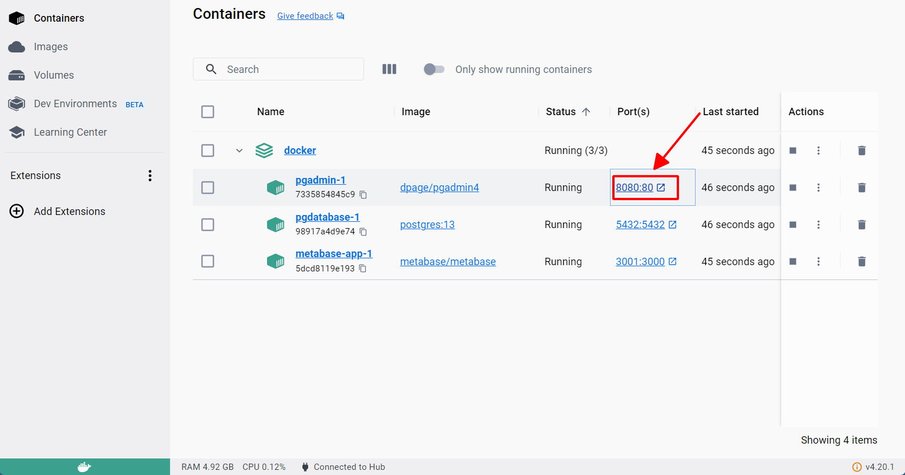|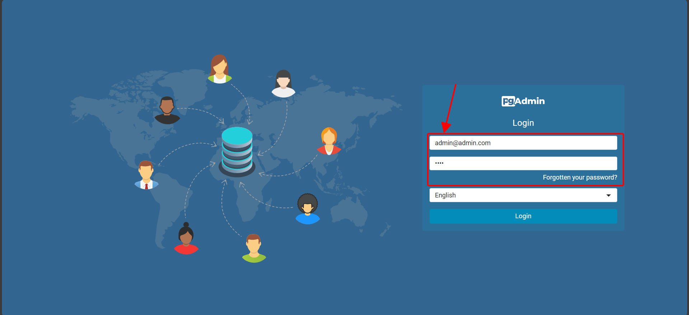|
|--------------------------------|--------------------------------|
||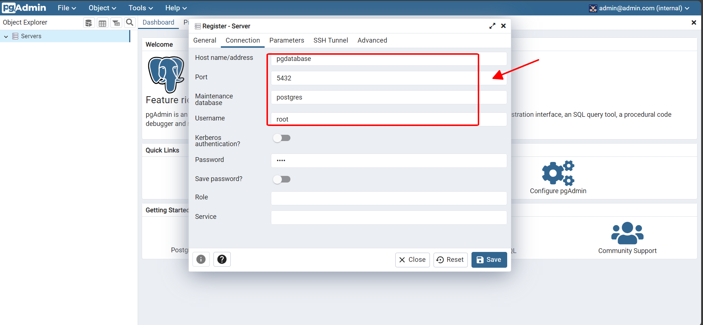|


## Step 2 and 3 - Retrieve datasets directly from the source, process and upload data to the database using `Prefect` and `Python`

Start the prefect orion service from the "prefect" directory:

```bash
prefect server start
```

Navigate to http://127.0.0.1:4200/blocks and configure the SQLAlchemy Connector block as follows (review the infomation in docker-compose file):

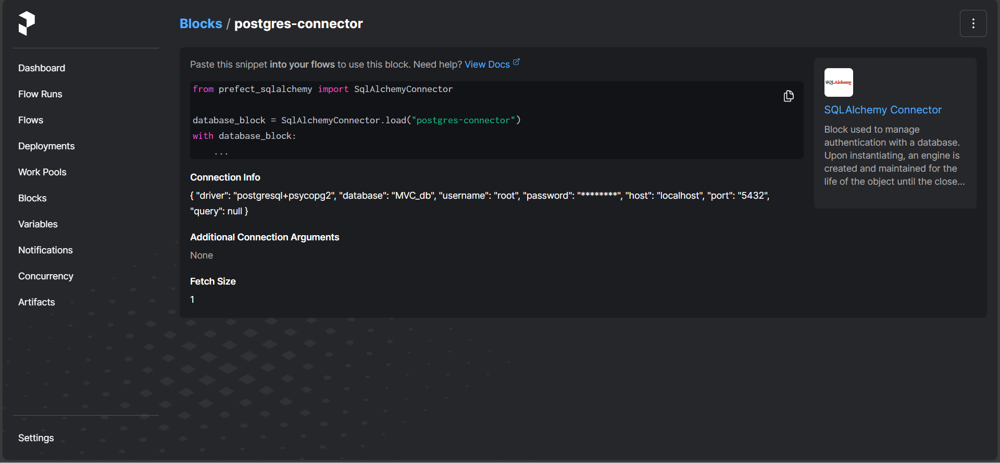

```
"name": "postgres-connector", "driver": "postgresql+psycopg2", "database": "MVC_db",

"username": "root", "password": "root", "host": "localhost", "port": "5432"
```

Generate the prefect deployment configuration:

```
prefect deployment build ./pipeline.py:MVC_main -n MVC_flow
```

Inspect the MVC_main-deployment.yaml and verify that the "working_dir:" field for file downloads isn't blank. It should match the "path:" entry within the MVC_main-deployment.yaml file.

To execute the new deployment, use:
```
prefect deployment apply MVC_main-deployment.yaml
```

Go to http://127.0.0.1:4200/deployments and edit parameters for downloading and processing data:

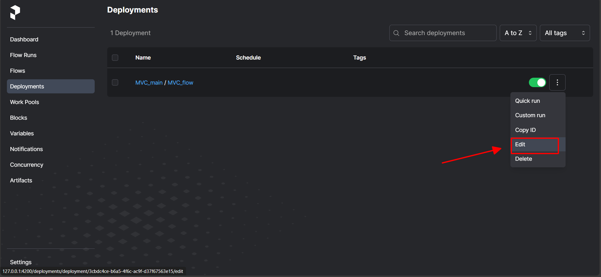

```
"name": "postgres-connector", "driver": "postgresql+psycopg2", "database": "MVC_db",

"username": "root", "password": "root", "host": "localhost", "port": "5432"
```

Create prefect deployment file:
```
prefect deployment build ./pipeline.py:MVC_main -n MVC_flow
```
Open MVC_main-deployment.yaml file and make sure that "working_dir:" for download files is not empty (should be same as "path:" string in MVC_main-deployment.yaml file).

Apply new deployment:
```
prefect deployment apply MVC_main-deployment.yaml
```
Go to http://127.0.0.1:4200/deployments and edit parameters for downloading and processing data:

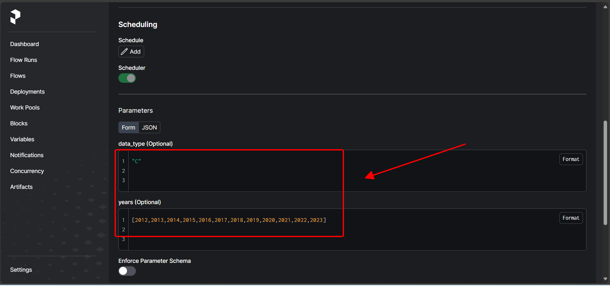

Select dataset for download:
  * "C" for Motor Vehicle Collisions - Crashes
  * "V" for Motor Vehicle Collisions - Vehicles
  * "P" for Motor Vehicle Collisions - Person 
  
Select years for partitioning and upload into database(separate table for each selected year) and save it. Years presented in the dataset:
```
[2012, 2013, 2014, 2015, 2016, 2017, 2018, 2019, 2020, 2021, 2022, 2023]
```

Start prefect queue with name "default":
```
prefect agent start  --work-queue "default"
```

Start quick run with selected parameters:

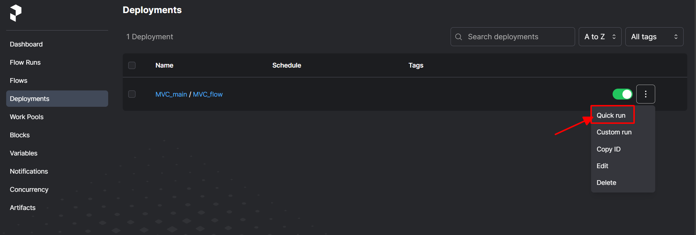

Data processing will start after uploading the CSV file. If the csv file was not completely downloaded, select data_type like "C reload"(example for "C" data type) and try again. It will start downloading the csv file with selected data type again.

Go to http://127.0.0.1:4200/flow-runs and check logs of started flow. If everything is done correctly, information about the processed data should appear in the logs:

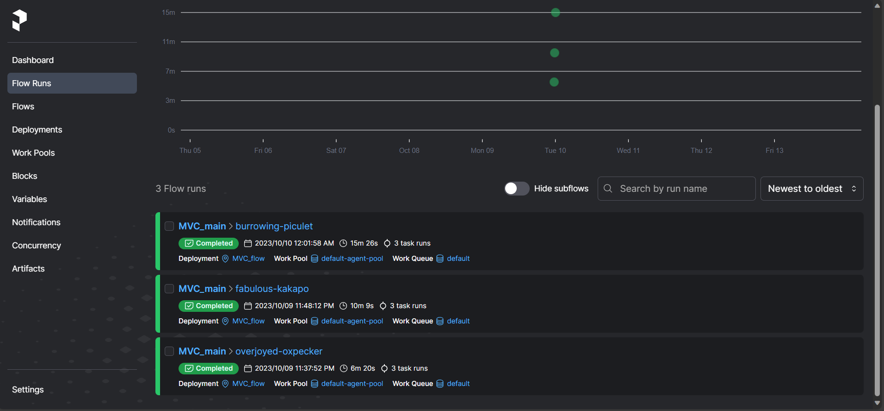

After finishing the data processing for the three datasets ("C", "V", and "P"), select "check" for the data_type and execute this process.

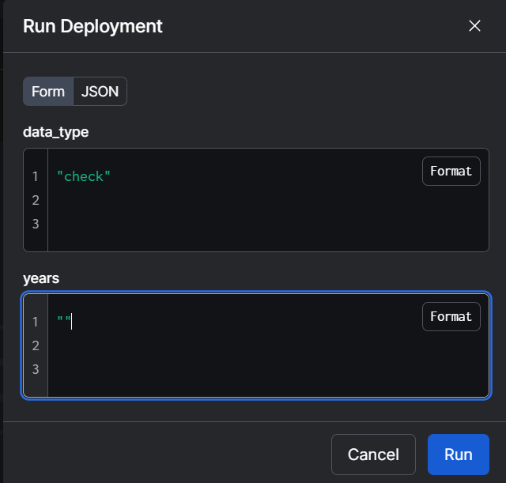

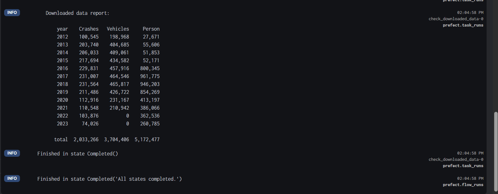

Make sure via pgAdmin, that all needed data was ingested in database(tables must be in "public" schema):

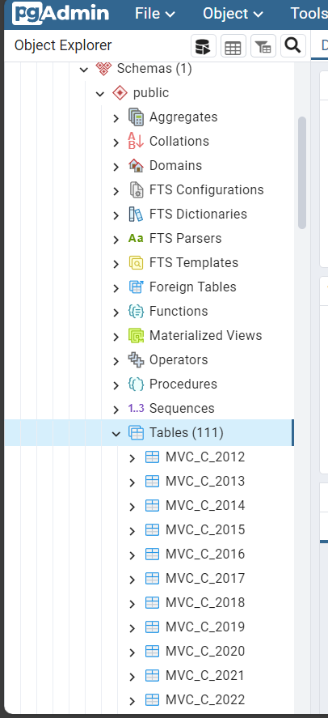

## Step 4 - Refine, model, and standardize data inside the database through `DBT`

Incorporate details into profiles.yml from the profiles.yml document.

Verify the link between the "dbt" directory and the database using:

```bash
dbt debug
```

```bash
$ dbt debug
07:39:53  Running with dbt=1.6.6
07:39:53  dbt version: 1.6.6
07:39:53  python version: 3.11.3
07:39:53  python path: C:\Users\cungt\anaconda3\python.exe
07:39:53  os info: Windows-10-10.0.22621-SP0
07:39:53  Using profiles dir at D:\code\github\de-motor-collision-data-pipeline\local\dbt
07:39:53  Using profiles.yml file at D:\code\github\de-motor-collision-data-pipeline\local\dbt\profiles.yml
07:39:53  Using dbt_project.yml file at D:\code\github\de-motor-collision-data-pipeline\local\dbt\dbt_project.yml
07:39:53  adapter type: postgres
07:39:53  adapter version: 1.6.6
07:39:53  Configuration:
07:39:53    profiles.yml file [OK found and valid]
07:39:53    dbt_project.yml file [OK found and valid]
07:39:53  Required dependencies:
07:39:53   - git [OK found]

07:39:53  Connection:
07:39:53    host: localhost
07:39:53    port: 5432
07:39:53    user: root
07:39:53    database: MVC_db
07:39:53    schema: public
07:39:53    connect_timeout: 10
07:39:53    role: None
07:39:53    search_path: None
07:39:53    keepalives_idle: 0
07:39:53    sslmode: None
07:39:53    sslcert: None
07:39:53    sslkey: None
07:39:53    sslrootcert: None
07:39:53    application_name: dbt
07:39:53    retries: 1
07:39:53  Registered adapter: postgres=1.6.6
07:39:53    Connection test: [OK connection ok]

07:39:53  All checks passed!
(base) 
```

Run this script:

```bash
dbt run
```

and then in your docker pgadmin, check your recently created tables

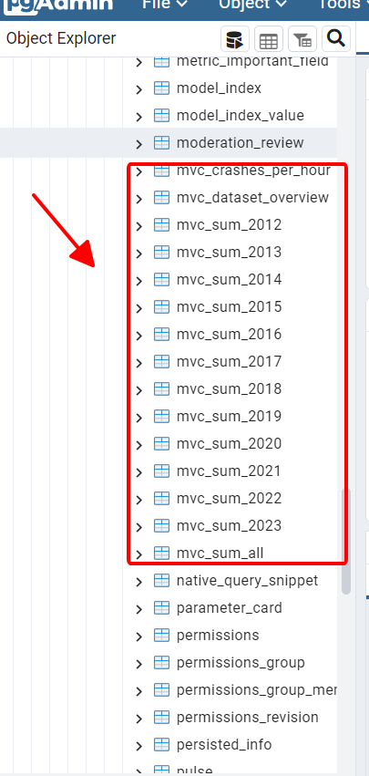

## Step 5 - Display the processed and standardized data using `Metabase`.

Access Metabase at http://localhost:3001. Create your metabase account. In my case i will create the email and password below:

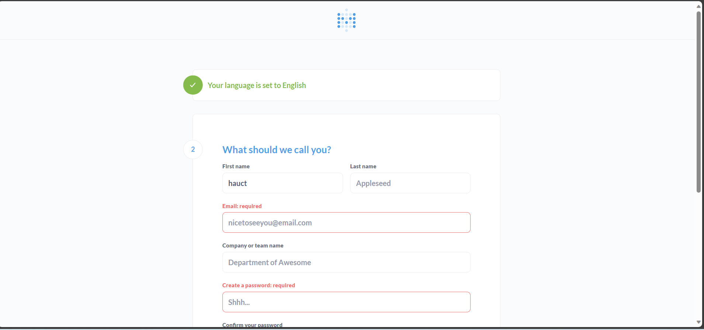

```bash
email = metabase@login.com
passwords = metabase123
```

Connect to your postgres database

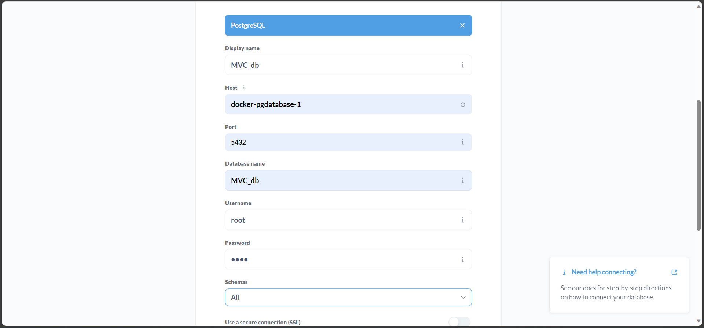

After that, return to `http://127.0.0.1:4200`, Run the deployment with the parameters above to create chart on metabase

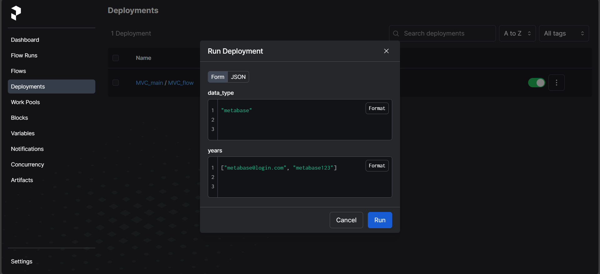

Everything is okay when you see the charts created on your metabase page

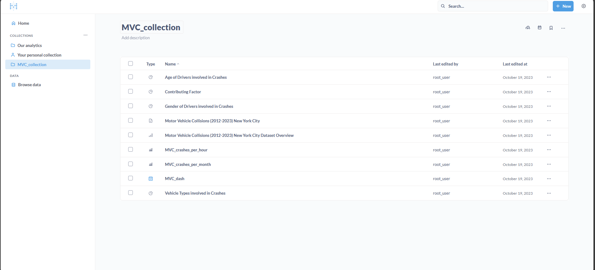

Now, you can create a dashboard, this depends on your custom style. Here is one example of mine:

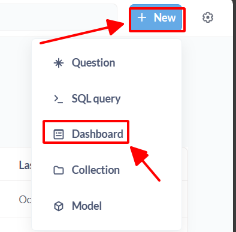

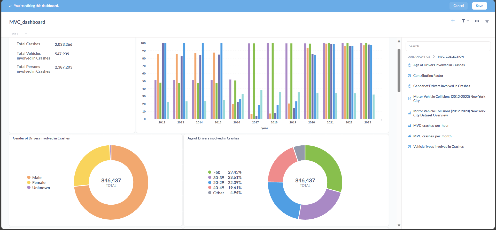

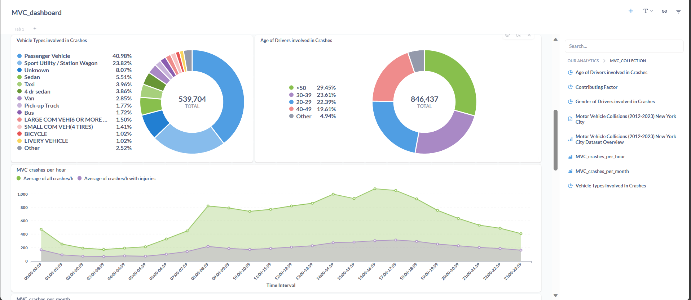

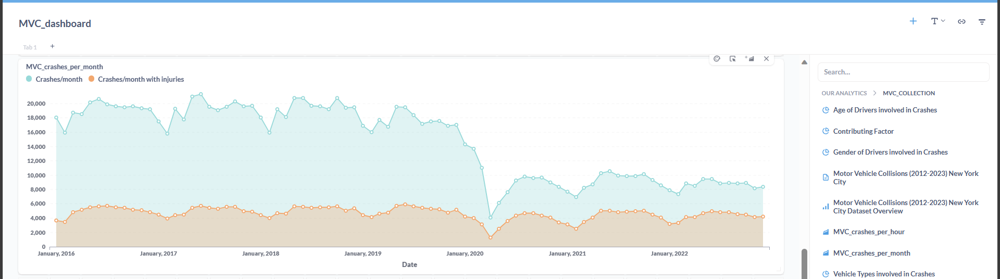


