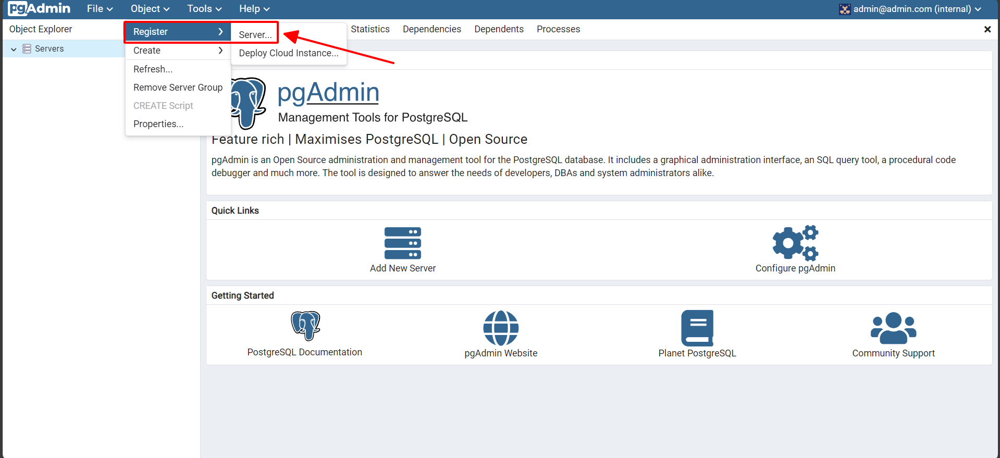

# Step-by-Step Guide for Data Engineering Zoomcamp Project (local version)

This manual provides the steps required to replicate the outcomes of the project:

[Step 0](https://github.com/KazarkinBarys/Data_Engineering_Zoomcamp_Project/blob/main/Local_version/README.md#step-0---preparation) - Preparation

## Project architecture

1. Establish a PostgreSQL database and its environment using `Docker`.
2. Retrieve datasets directly from the source using `Prefect` and `Python`.
3. Process and upload data to the database with the help of `Prefect` and `Python`.
4. Refine, model, and standardize data inside the database through `DBT`.
5. Display the processed and standardized data using `Metabase`.

## Step 0 - preparation
Need to be installed:
  * Windows or Linux
  * Docker and Docker-compose
  * python 3*
  * dbt-postgres
  * pip libraries from requirements.txt
  
In our project working dir, run this script

```
pip install -r requirements.txt
pip install dbt-postgres
```

## Establish a PostgreSQL database and its environment using `Docker`.

Begin by specifying your mount volumes within the docker-compose.yaml file.

Execute the docker-compose command from the "docker" directory:

```bash
docker-compose up -d
```

Upon running this, it will instantiate the PostgreSQL database, along with pgAdmin and Metabase containers, all using the credentials provided in the docker-compose.yaml file.

To establish a connection to the PostgreSQL database through pgAdmin, navigate to http://localhost:8080 in your web browser. Enter the login credentials as specified in the docker-compose.yaml file and proceed to set up the server connection:

|                                |                                |
|--------------------------------|--------------------------------|
|||
|--------------------------------|--------------------------------|
|||


## Step 2 and 3 - Retrieve datasets directly from the source, process and upload data to the database using `Prefect` and `Python`

Start the prefect orion service from the "prefect" directory:

```bash
prefect server start
```

Navigate to http://127.0.0.1:4200/blocks and configure the SQLAlchemy Connector block as follows (review the infomation in docker-compose file):


```
"name": "postgres-connector", "driver": "postgresql+psycopg2", "database": "MVC_db",

"username": "root", "password": "root", "host": "localhost", "port": "5432"
```

Generate the prefect deployment configuration:

```
prefect deployment build ./pipeline.py:MVC_main -n MVC_flow
```

Inspect the MVC_main-deployment.yaml and verify that the "working_dir:" field for file downloads isn't blank. It should match the "path:" entry within the MVC_main-deployment.yaml file.

To execute the new deployment, use:
```
prefect deployment apply MVC_main-deployment.yaml
```

Go to http://127.0.0.1:4200/deployments and edit parameters for downloading and processing data:


```
"name": "postgres-connector", "driver": "postgresql+psycopg2", "database": "MVC_db",

"username": "root", "password": "root", "host": "localhost", "port": "5432"
```

Create prefect deployment file:
```
prefect deployment build ./pipeline.py:MVC_main -n MVC_flow
```
Open MVC_main-deployment.yaml file and make sure that "working_dir:" for download files is not empty (should be same as "path:" string in MVC_main-deployment.yaml file).

Apply new deployment:
```
prefect deployment apply MVC_main-deployment.yaml
```
Go to http://127.0.0.1:4200/deployments and edit parameters for downloading and processing data:


Select dataset for download:
  * "C" for Motor Vehicle Collisions - Crashes
  * "V" for Motor Vehicle Collisions - Vehicles
  * "P" for Motor Vehicle Collisions - Person 
  
Select years for partitioning and upload into database(separate table for each selected year) and save it. Years presented in the dataset:
```
[2012, 2013, 2014, 2015, 2016, 2017, 2018, 2019, 2020, 2021, 2022, 2023]
```

Start prefect queue with name "default":
```
prefect agent start  --work-queue "default"
```

Start quick run with selected parameters:


Data processing will start after uploading the CSV file. If the csv file was not completely downloaded, select data_type like "C reload"(example for "C" data type) and try again. It will start downloading the csv file with selected data type again.

Go to http://127.0.0.1:4200/flow-runs and check logs of started flow. If everything is done correctly, information about the processed data should appear in the logs:


After finishing the data processing for the three datasets ("C", "V", and "P"), select "check" for the data_type and execute this process.


